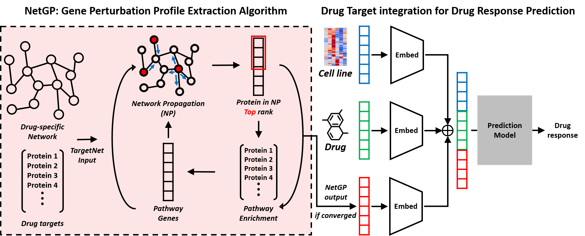
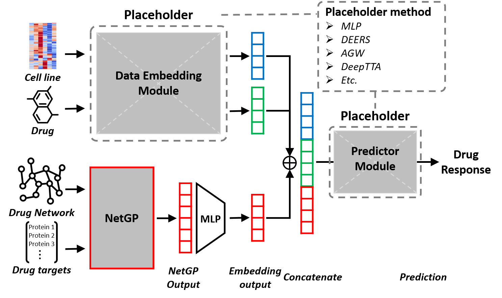

# NetGP
NetGP (Network-based Gene Perturbation): a network-based gene perturbation profile extraction algorithm.  
A novel method for computing perturbation effects of a drug treatment.  


Drug response prediction (DRP) is important for precision medicine to predict how a patient would react to a drug before administration. Existing studies take the cell line transcriptome data, and the chemical structure of drugs as input and predict drug response as IC50 or AUC values. Intuitively, use of drug target interaction (DTI) information can be useful for DRP. However, use of DTI is difficult because existing drug response database such as CCLE and GDSC do not have information about transcriptome after drug treatment. Although transcriptome after drug treatment is not available, if we can compute the perturbation effects by the pharmacologic modulation of target gene, we can utilize the DTI information in CCLE and GDSC. In this study, we proposed a framework that can improve existing deep learning-based DRP models by effectively utilizing drug target information. Our framework includes NetGP, a module to compute gene perturbation scores by the network propagation technique on a PPI network. NetGP produces genes in a ranked list in terms of gene perturbation scores and the ranked genes are input to a MLP to generate a fixed dimension vector for the integration with existing DRP models. This integration is done in a model-agnostic way so that any existing DRP tool can be incorporated. As a result, our framework boosts the performance of existing DRP models, in 44 of 48 comparisons. The performance gains are larger especially for test scenarios with samples with unseen drugs by large margins up to 34% in Pearson correlation coefficient.



# Install
```
matplotlib 3.5.1  
numpy 1.22.3  
pandas 1.4.2  
pytorch 1.10.0  
torchvision 0.11.1  
scipy 1.8.1  
scikit-learn 1.1.1  
prettytable 3.3.0  
subword-nmt 0.3.8  
tensorboard 2.9.1  
rdkit 2022.3.1.1  
```

# Data
 * __Drug data__: Data/model_input/drug_data.tsv
 * __Cell line gene expression data__: Data/model_input/rna_input.tsv
 * __Gene perturbation profile data__: Data/model_input/iterative_enrich_np_consensus.tsv
 * __Drug response data__: Data/model_input/cv_[split_type]/[train/valid/test]_response_by_both_cv[0-20].tsv
 
 # Run Step
 ## 1. Gene Perturbation Profile Extraction using NetGP
 
 ```bash
 DATADIR="NetGP/Data"
 
 python run_NetGP.py \
    --rna_fpath $DATADIR//model_input/rna_input.tsv \
    --drug_fpath $DATADIR/model_input/drug_data.tsv \
    --ppi_fpath $DATADIR/9606.protein.links.symbols.v11.5.txt \
    --out_fpath $DATADIR/model_input/netGP_profile.out
```
The above command outputs gene perturbation profile to `Data/model_input/netGP_profile.out`  
(the extracted gene perturbation profile used in the paper is: `Data/model_input/iterative_enrich_np_consensus.tsv`)
The input to NetGP are: 'Cell line gene expression data', 'Drug data', 'STRING template network'.  
(STRING template network can be obtained from [STRING_database](https://string-db.org/cgi/download?sessionId=bJ9NZpNP7Bn4&species_text=Homo+sapiens).  
The gene names have to be converted from ensembl IDs to gene symbols.)

 
 ## 2. Drug Target Integration for Drug Response Prediction
 The extracted gene perturbation profile can be integrated to any existing deep learning models.  
 The experimental setup is shown in the below image.
 

 The "2_DrugTarget_Integration_for_Drug_Response_Prediction" directory contains the codes to train [DeepTTA](https://academic.oup.com/bib/article/23/3/bbac100/6554594), [DEERS](https://www.nature.com/articles/s41598-021-94564-z), [AGW](https://academic.oup.com/bib/article/23/2/bbab534/6501725), and MLP models with and without the gene perturbation profile (from NetGP) integration.  
 
 The example commands to run the training are the following:
 ```bash
 # Train DEERS without gene perturbation profile integration (Original model)
 python train_deers.py --split_type both --response_type IC50 --device 0

 # Train DEERS with gene perturbation profile integration (with NetGP)
 python train_deers_netgp.py --split_type both --response_type IC50 --device 0

 # Train DeepTTA without gene perturbation profile integration (Original model)
 python train_deeptta.py --split_type both --response_type IC50 --device 0
 
 # Train DeepTTA with gene perturbation profile integration (with NetGP)
 python train_deeptta_netgp.py --split_type both --response_type IC50 --device 0

 ```
 
 or alternatively, you can run the .sh scripts in the corresponding model directory.
```bash
./run_train_deers.sh
./run_train_deers_netgp.sh
```
 
 The results of other models presented in the paper can be found in `./2_DrugTarget_Integration_for_Drug_Response_Prediction/Results/`.
 
